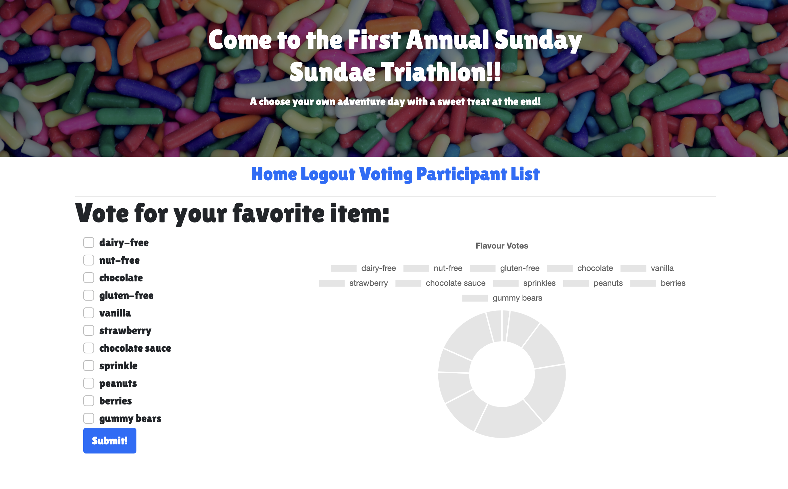

# SundaeSundayTriathlon
Come to the first annual Sundae Sunday Ice Cream Triathlon!! An adventure that ends in an ice cream sweet treat.

## Description 
[SundaeSundayIceCream Link](https://sundaesunday.herokuapp.com/)

On this site, users will see all the information about the days events including the swimming, biking, and running routes for the day. The idea is that you can choose your own adventure and participate as much as you would like. This website was built using javascript, node, handlebars, MySQL2 and Sequelize packages to connect the Express.js API to a MySQL database that collects the users email, name, what event they are most excited by, and their favorite ice cream flavors. There are a few small animations sprinkled in as well, so enjoy looking around and hopefully see you at the event!

Homepage:

Login Screen:

Participant List:

Voting:

## Table of Contents: 
- [Description](#description) 
- [Credits](#credits) 
- [Criteria](#criteria)
- [Questions](#questions)

## Criteria
- Use Node.js and Express.js to create a RESTful API.
- Use Handlebars.js as the template engine.
- Use MySQL and the Sequelize ORM for the database.
- Have both GET and POST routes for retrieving and adding new data.
- Use at least one new library, package, or technology that we haven’t discussed.
- Have a folder structure that meets the MVC paradigm.
- Include authentication (express-session and cookies).
- Protect API keys and sensitive information with environment variables.
- Be deployed using Heroku (with data).
- Have a polished UI.
- Be responsive.
- Be interactive (i.e., accept and respond to user input).
- Meet good-quality coding standards (file structure, naming conventions, follows best practices for class/id naming conventions, indentation, quality comments, etc.).

## Credits: 
Thanks the tutors and TA's for helping us get through this project. 

| Developers         | GitHub Profile|
| -----------  | ----------- |
|Casey Fee|[caseyfee](https://github.com/caseyfee)
|Jeff Corpuz|[Jeff Corpuz](https://github.com/jegaco) |
|Madilyn Bariekman |[Madilyn Bariekman](https://github.com/mcbariekman)
|Nathan Stepper|[Nathan Stepper](https://github.com/nstepper)

## Questions
Feel free to check out our presentation at: caseyfee3@gmail.com